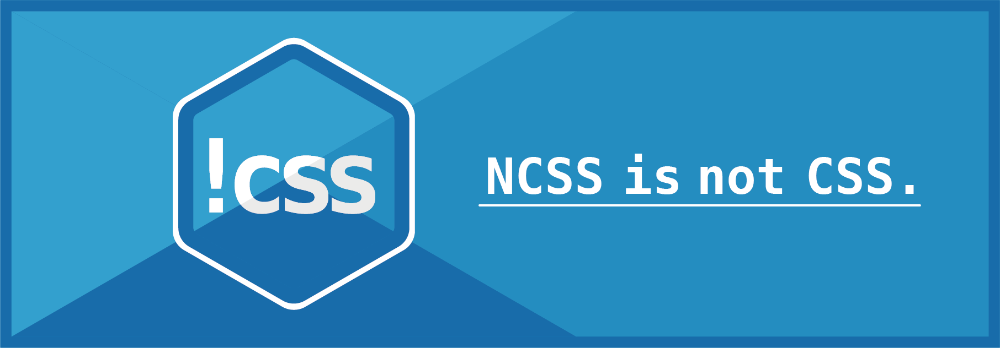

# NCSS project


### Have you ever experienced something like this?
> A. What programming languages have you used?  
> B. Hmm..."HTML" and "CSS".  
> A. (It is not programming languages...)  

So i make css a programming language!

## Install
```zsh
npm install -g @satooru65536/ncss
```

## VScode extensions
- [ncss snippets](https://marketplace.visualstudio.com/items?itemName=SatooRu65536.ncss-snippets)
- [ncss formatter](https://marketplace.visualstudio.com/items?itemName=SatooRu65536.ncss-formatter)
- [ncss support](https://marketplace.visualstudio.com/items?itemName=SatooRu65536.ncss-support)

## Details
=> [README](https://github.com/ncss-project/ncss#readme)
